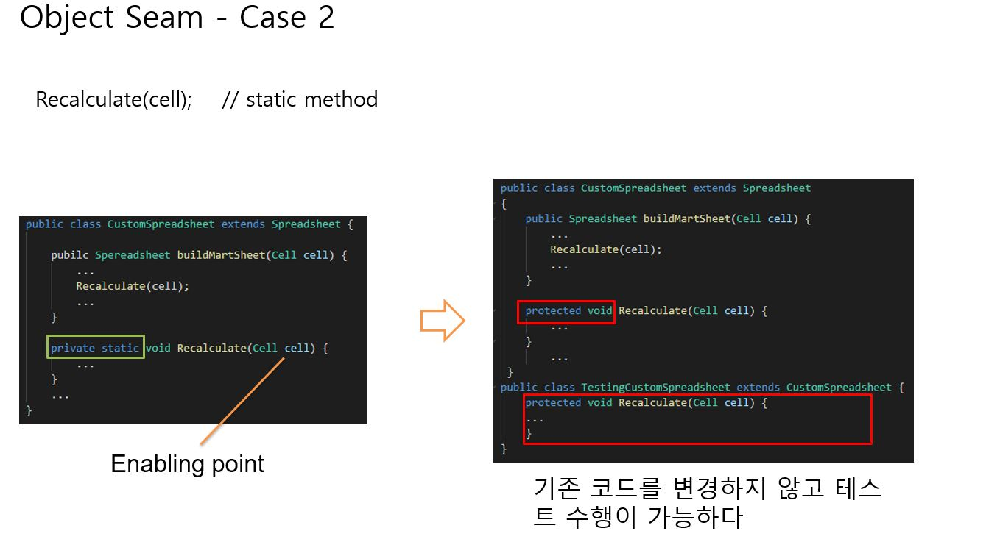

# Service Layer 테스트 케이스 작성




## Service Unit 테스트 작성 - Object Seam

* 테스트 대상을 OrderService -> TestableOrderService로 변경

* OrderServiceTest내 Inner Class로 TestableOrderService 클래스 생성

```java
public class OrderServiceTest {

    private boolean isTodayLastDayOfMonth = false;
    
    private TestableOrderService subject;

    @Before
    public void setUp() throws Exception {
        subject = new TestableOrderService(mockOrderRepository,
                mockMileageApiService,
                mockCustomerService,
                mockBeverageRepository,
                mockOrderItemRepository);

        Beverage beverage = new Beverage(1, "americano", 1000, BeverageSize.SMALL);
        when(mockBeverageRepository.getOne(1)).thenReturn(beverage);
    }

    private class TestableOrderService extends OrderService {
        public TestableOrderService(OrderRepository orderRepository,
                                    MileageApiService mileageApiService,
                                    CustomerService customerService,
                                    BeverageRepository beverageRepository,
                                    OrderItemRepository orderItemRepository) {
            super(orderRepository, mileageApiService,
                    customerService, beverageRepository, orderItemRepository);
        }

        @Override
        protected boolean isLastDayOfMonth() {
            return isTodayLastDayOfMonth ;
        }
    }
}
```

* 마지막날로 변경한 후 테스트 수행

```java
public class OrderServiceTest {
    @Test
    public void 매월_마지막날에_주문하면_TotalCost에서_10퍼센트가_할인된다() {
        //given
        isTodayLastDayOfMonth = true;

        Calendar calendar = mock(Calendar.class);
        when(calendar.getActualMaximum(Calendar.DATE)).thenReturn(31);
        when(calendar.get(Calendar.DATE)).thenReturn(31);
        Map<String, Object> orderItem = new HashMap<>();
        orderItem.put("beverageId", 1);
        orderItem.put("count", 2);

        List<Map<String, Object>> orderItemList = Arrays.asList(orderItem);

        //when
        Order result = subject.create(CUSTOMER_ID, orderItemList, PAYMENT_CASH);

        //then
        assertThat(result.getTotalCost(), is(1800.0));
    }
}
```


* PAYMENT type이 다른 테스트 코드 작성

```java
public class OrderServiceTest {
    private static final int CUSTOMER_ID = 12345;
    private static final int PAYMENT_CASH = 1;
    private static final int PAYMENT_CARD = 2;
    private static final int AMERICANO_ID = 1;
    private static final int NOT_EXIST_BEVERAGE_ID = 2;

    @Test
    public void 현금으로_결제시_TotalCost의_10퍼센트를_마일리지로_적립한다() {
        //given
        Map<String, Object> orderItem = getOrderItem(AMERICANO_ID, 2);

        List<Map<String, Object>> orderItemList = Arrays.asList(orderItem);

        //when
        Order result = subject.create(CUSTOMER_ID, orderItemList, PAYMENT_CASH);

        //then
        assertThat(result.getMileagePoint(), is(200.0));
    }

    @Test
    public void 카드로_결제시_TotalCost의_5퍼센트를_마일리지로_적립한다() {
        //given
        Map<String, Object> orderItem = getOrderItem(AMERICANO_ID, 2);

        List<Map<String, Object>> orderItemList = Arrays.asList(orderItem);

        //when
        Order result = subject.create(CUSTOMER_ID, orderItemList, PAYMENT_CARD);

        //then
        assertThat(result.getMileagePoint(), is(100.0));
    }

    private Map<String, Object> getOrderItem(int id, int count) {
        Map<String, Object> orderItem = new HashMap<>();
        orderItem.put("beverageId", id);
        orderItem.put("count", count);
        return orderItem;
    }
}
```

* test-step-01 branch

[이전](TDD_03_write_tests_in_service_layer.md) [다음](TDD_05_mock_verify_argument_captor.md)