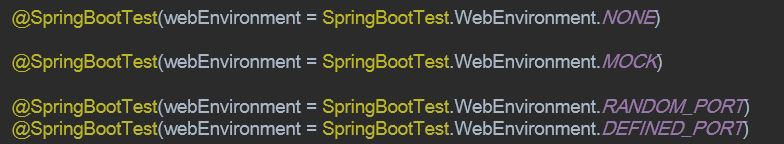
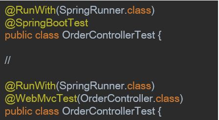

# Web Layer 테스트 케이스 작성

## Controller - Mock을 사용하지 않는 경우

* GET API 호출 테스트 작성

```java
import org.junit.Test;
import org.junit.runner.RunWith;
import org.springframework.beans.factory.annotation.Autowired;
import org.springframework.boot.test.autoconfigure.web.servlet.AutoConfigureMockMvc;
import org.springframework.boot.test.context.SpringBootTest;
import org.springframework.http.MediaType;
import org.springframework.test.context.junit4.SpringRunner;
import org.springframework.test.web.servlet.MockMvc;
import org.springframework.test.web.servlet.request.MockMvcRequestBuilders;

import static org.hamcrest.Matchers.is;
import static org.springframework.test.web.servlet.result.MockMvcResultMatchers.*;

@RunWith(SpringRunner.class)
@SpringBootTest
@AutoConfigureMockMvc
public class OrderControllerAPITest {

    @Autowired
    private MockMvc mockMvc;

    @Test
    public void OrderId로_GET_API를_요청하면_해당_ORDER를_리턴한다() throws Exception {
        String orderResult = "{\"id\":100,\"totalCost\":3000.0,\"mileagePoint\":100.0,\"payment\":1,\"status\":\"PREPARING\",\"orderItems\":[{\"id\":1,\"count\":3}],\"customer\":{\"id\":1,\"name\":\"customer1\"}}";

        mockMvc.perform(MockMvcRequestBuilders.get("/api/v1/orders/100"))
                .andExpect(jsonPath("$.id").value(100))
                .andExpect(jsonPath("$.status").value("PREPARING"))
                .andExpect(content().string(is(orderResult)))
                .andExpect(status().isOk());
    }
}
```

* POST API 호출 테스트 작성

```java

public class OrderControllerAPITest {

    @Autowired
    private MockMvc mockMvc;

    @Test
    public void 주문정보로_POST_API를_요청하면_해당_주문을_생성한다() throws Exception {
        String orderParam = "{\"customerId\": 1,\"payment\": 3,\"orderItems\": []}";

        mockMvc.perform(
                MockMvcRequestBuilders
                        .post("/api/v1/orders")
                        .content(orderParam)
                        .contentType(MediaType.APPLICATION_JSON))
                .andExpect(status().isOk());
    }
}
```

## Quiz

* 차이점은 무엇일까요? 



* 차이점은 무엇일까요?



## Controller - Mock을 사용하는 경우

* GET API 호출 테스트 작성
       
    * OrderService를 stubbing하여 테스트 케이스 성공    
 
 ```java
@RunWith(SpringRunner.class)
@WebMvcTest(OrderController.class)
public class OrderControllerSliceTest {

    @Autowired
    MockMvc mockMvc;

    @MockBean
    OrderService mockOrderService;

    @Test
    public void OrderId로_GET_API를_요청하면_해당_ORDER를_리턴한다() throws Exception {
        Order order = new Order();
        order.setTotalCost(10000.0);
        order.setStatus(OrderStatus.WAITING);
        when(mockOrderService.getOrder(100)).thenReturn(order);

        mockMvc.perform(MockMvcRequestBuilders.get("/api/v1/orders/100"))
                .andExpect(jsonPath("$.totalCost").value(10000))
                .andExpect(jsonPath("$.status").value("WAITING"))
                .andExpect(status().isOk());
    }
}
```

* POST API 호출 테스트 작성

```java
@RunWith(SpringRunner.class)
@WebMvcTest(OrderController.class)
public class OrderControllerSliceTest {

    @Autowired
    MockMvc mockMvc;

    @MockBean
    OrderService mockOrderService;

    @Test
    public void 주문정보로_POST_API를_요청하면_해당_주문을_생성한다() {
        String orderParam = "{\"customerId\": 1,\"payment\": 3,\"orderItems\": []}";

        Order order = new Order();
        order.setTotalCost(10000.0);
        order.setStatus(OrderStatus.WAITING);
        when(mockOrderService.create(1, Collections.emptyList(), 3)).thenReturn(order);

        mockMvc.perform(MockMvcRequestBuilders.post("/api/v1/orders")
                .content(orderParam)
                .contentType(MediaType.APPLICATION_JSON))
                .andExpect(jsonPath("$.totalCost").value(10000))
                .andExpect(jsonPath("$.status").value("WAITING"))
                .andExpect(status().isOk());
    }
}
```

* setUp 메서드에 테스트를 위한 초기 데이터 준비


[이전](TDD_05_mock_verify_argument_captor.md) [다음](TDD_07_write_tests_in_repository_layer.md)